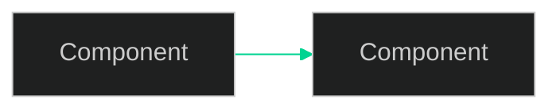

# Infographic Skill

Produces brand-consistent visual artifacts that communicate data and structure.

## Mode Selection

Determine which mode to use:

| Mode | When | Output |
|------|------|--------|
| **React Artifact** | In Claude.ai, user wants interactive/embeddable visual | `.jsx` React component |
| **Matplotlib PNG** | In Claude Code, user wants file to save/embed in doc | `.png` via Python |
| **SVG** | Simple, static diagram needing precise geometry | `.svg` in artifact |
| **Mermaid** | Architecture/flow diagrams, quick system maps | Mermaid code block |

Default to **React Artifact** in Claude.ai, **Matplotlib PNG** in Claude Code.

## Step 1: Context + Content Analysis

Run brand-guidelines skill to identify context (A/B/C).
Then determine infographic type:

| Type | Use when | Template |
|------|----------|---------|
| `metric-card` | Showing KPIs, stats, single numbers | MetricCard.jsx |
| `comparison-table` | Comparing 2–4 options across attributes | ComparisonTable.jsx |
| `process-flow` | Step-by-step workflow, numbered stages | ProcessFlow.jsx |
| `arch-diagram` | System/component architecture | ArchDiagram.jsx |
| `timeline` | Chronological events or phases | TimelineView.jsx |
| `bar-chart` | Categorical data comparison | Chart.jsx (recharts) |
| `breakdown` | Part-to-whole, proportions | Chart.jsx (recharts) |

## Step 2: React Artifact Mode

### Grammar Rules for Context A (AI OS System)

```jsx
// ROOT TOKENS — inject at component top
const tokens = {
  bgVoid: '#080810',
  bgBase: '#0d0d14',
  bgSurface: '#12121e',
  bgElevated: '#1a1a2e',
  border: '#1f1f35',
  accentPrimary: '#00D492', // from BRAND_IDENTITY.md
  textPrimary: '#EEEAE4',
  textSecondary: '#A09D95',
  textMuted: '#606060',
  fontHeading: '"DM Sans", sans-serif',
  fontMono: '"JetBrains Mono", monospace',
};

// SECTION NUMBER PATTERN
// <span style={{fontFamily: tokens.fontMono, color: tokens.accentPrimary}}>01 —</span>
// <span style={{fontFamily: tokens.fontHeading, fontWeight: 700}}> Section Title</span>

// METRIC DISPLAY PATTERN
// Large number: JetBrains Mono, 36–48px, 600 weight, text-primary
// Label below: DM Sans, 12px, text-muted, UPPERCASE

// CARD PATTERN
// background: bgSurface, border: `1px solid ${tokens.border}`, borderRadius: 8px
// NO box-shadow on dark backgrounds
```

### Grammar Rules for Context B (Bharatvarsh)

```jsx
const tokensB = {
  bgBase: '#0F1419',
  bgSurface: '#1A1F2E',
  accentMustard: '#F1C232',
  accentPowder: '#C9DBEE',
  textPrimary: '#F0F4F8',
  fontDisplay: '"Bebas Neue", sans-serif',
  fontBody: 'Inter, sans-serif',
  fontMono: '"JetBrains Mono", monospace',
  glowMustard: '0 0 20px rgba(241,194,50,0.3)',
};
// Add film grain effect: ::after pseudo with SVG noise (opacity 0.04)
// Add vignette: radial-gradient overlay on containers
```

### Grammar Rules for Context C (Portfolio)

```jsx
const tokensC = {
  bgLight: '#fafafa',
  bgDark: '#0a0a0a', // Dark Gallery mode only
  primary: '#8b5cf6',
  accent: '#f97316',
  textHeading: '#171717',
  textBody: '#404040',
  fontAll: 'Inter, sans-serif',
  fontMono: '"JetBrains Mono", monospace',
};
```

### Template Usage

If the type matches a template in `assets/react-templates/`, use that template:

```jsx
// Import pattern (when running in Claude Code with filesystem access)
// In artifacts, inline the template code

// MetricCard — usage:
// <MetricCard value="34" label="MCP Tools" trend="+12 this sprint" context="A" />

// ComparisonTable — usage:
// <ComparisonTable
//   headers={['Feature', 'Current', 'Planned']}
//   rows={[...]}
//   context="A"
//   highlightCol={1}
// />

// ProcessFlow — usage:
// <ProcessFlow
//   steps={[{num: '01', title: 'Extract', desc: '...'}, ...]}
//   context="A"
// />
```

### Libraries Available in Artifacts

- `recharts` — bar, line, pie, area charts
- `d3` — custom layouts, force graphs
- `lucide-react` — icons
- `@/components/ui/` — shadcn primitives if available

Always use CSS variables or inline token objects — never hardcode colors.

## Step 3: Matplotlib PNG Mode (Claude Code only)

```python
# Load the brand theme before any plot
import matplotlib
matplotlib.style.use('skills/infographic/assets/mpl-themes/ai_os_system.mplstyle')
import matplotlib.pyplot as plt
import matplotlib.patches as mpatches
import numpy as np

# Standard figure setup for Context A
fig, ax = plt.subplots(figsize=(12, 7))
fig.patch.set_facecolor('#0d0d14')
ax.set_facecolor('#12121e')

# Accent color for primary data series — from theme file
# Fallback: ACCENT_PRIMARY = '#00D492'  # from BRAND_IDENTITY.md

# Always add section label (Context A grammar)
fig.text(0.05, 0.97, '01 —  CHART TITLE',
         fontfamily='DM Sans', fontsize=11, fontweight=600,
         color=ACCENT_PRIMARY, transform=fig.transFigure,
         verticalalignment='top')

# Output
plt.savefig('output_name.png', dpi=150, bbox_inches='tight',
            facecolor=fig.get_facecolor())
```

For Context B matplotlib outputs (if needed):
- facecolor: `#0F1419`, accent: `#F1C232`, title font: Bebas Neue (if available) or DM Sans 800

## Step 4: Mermaid Mode

For architecture / flow diagrams, use Mermaid with Context A styling:



## Quality Checklist

Before finalizing any infographic:

```
[] Brand context declared (A/B/C)
[] No hardcoded colors — all from token variables
[] Correct font loaded (not Inter in Context A, not DM Sans in Context B)
[] Section number label applied (Context A only)
[] Legend/labels use text-muted or text-secondary, not primary
[] No box-shadow on dark backgrounds
[] Data is accurate (double-check numbers)
[] Mobile-readable (min 11px labels)
[] Export resolution >= 150dpi for PNG outputs
```

## Reference

Full token tables: `references/TOKENS.md`
React templates: `assets/react-templates/*.jsx`
Matplotlib themes: `assets/mpl-themes/*.mplstyle`
